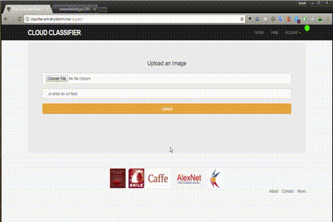

This is the term project for Software Engineering lecture at Gebze Technical University - Turkey

The project contains two seperate modules.
- A web app that was written with Ruby on Rails
- A client-server based classifier module (ImageNet - AlexNet - Caffe)

